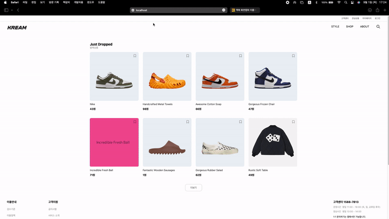

## 개요
* Kream 쇼핑몰 웹 사이트 클론코딩
* JSON서버와 MongoDB 활용하여 Mock 데이터 연동을 통해 구현
* 구현분야 
  * 메인페이지 레이아웃 구현
  * HTTP 통신을 통한 특정 제품 상세 정보 렌더링
  * 관심상품 클릭시, 내 관심상품 등록 및 삭제
  * 로그인 / 이메일 가입 정보 요청 및 반영

## 사용한 기술
 * React, Tailwind, Redux